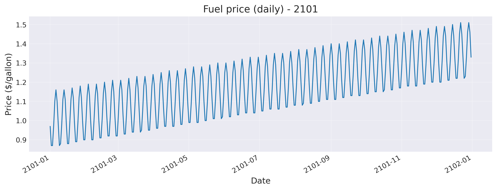
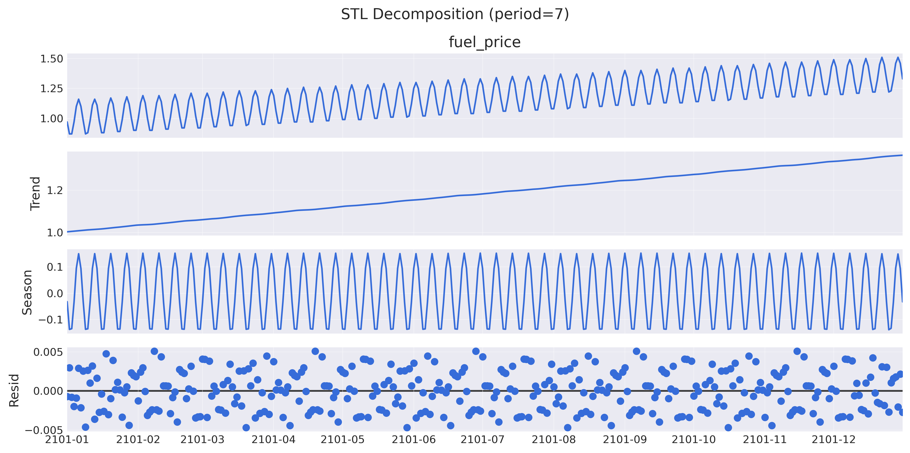
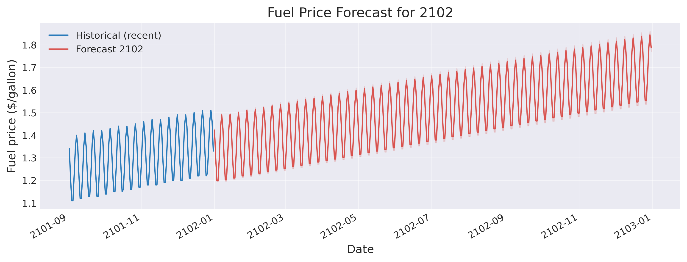
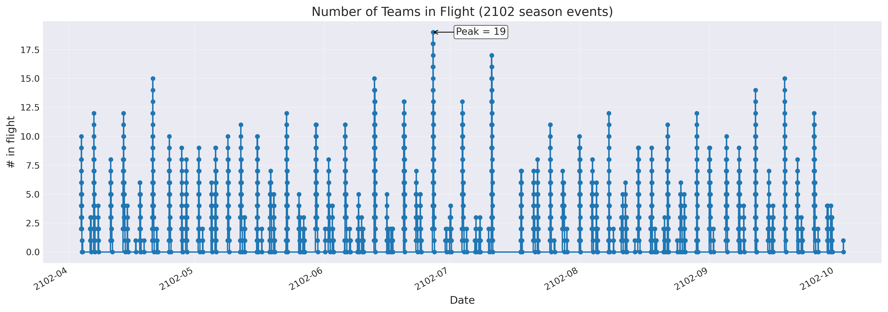

# ⏱️ Time Series Analysis for Transportation (flights)

[](https://www.python.org/)
[](LICENSE)
[](README.md)


## 📋 Project Overview

This repository contains a complete analysis that answers two operational questions for The 22nd Century Sporting League:

1. What is the maximum number of jets The League needs to own to cover simultaneous team flights during the 2102 season? (max_teams_in_flight)
2. What is the projected total fuel spend for all flights in 2102 using 2101 daily fuel prices and time-series forecasting? (total_fuel_spend_2102_dollars)

Using the provided `team_flights.csv` (2102 season schedule) and `fuel_prices_2101.csv` (daily 2101 fuel prices), I built a robust pipeline that:
- Cleans and validates raw CSVs (handles malformed/concatenated rows and mixed timestamp formats).
- Computes an event-based in-flight time series to determine peak simultaneous flights.
- Builds a time-series forecasting model (SARIMAX / auto-ARIMA) for daily fuel prices and produces 2102 forecasts with 95% confidence intervals.
- Applies the forecasted fuel prices to every flight (assuming 500 MPH and 1 gallon/mile) to compute the projected fuel spend for 2102, with propagated uncertainty.

---
## 📁 Project Structure
```
Time-Series-Analysis-for-Transportation/
│ 
├── analysis_files/ 
│   ├── flights_ts_analysis.ipynb               # Main analysis notebook 
│   └── flights_ts_analysis.py                  # Main analysis python file
│ 
├── data/                                       # Original raw input files
│   ├── team_flights.csv                        
│   └── fuel_prices_2101.csv                     
│ 
├── clean_data/                                 # Cleaned CSV outputs       
│   ├── team_flights_clean.csv                         
│   ├── fuel_prices_2101_clean.csv 
│   └── in_flight_events.csv
│   
├── plots/                                      # Visualization outputs
│   ├── fuel_price_2101_series.png 
│   ├── fuel_price_2101_stl.png                         
│   ├── fuel_prices_2102_forecast.png 
│   └── teams_in_flights_2102.png
│ 
├── requirements.txt                            # Python dependencies 
├── README.md                                   # Project documentation 
├── CONFIG.json                                 # Configuration file
└── results_summary.json                        # Results summary
```

---
## 📝 Quick Results (Executive Summary)

1. max_teams_in_flight: 19
   - **Interpretation**: At the busiest instant during the 2102 season, 19 teams are simultaneously airborne. This number is the minimum required number of jets to avoid chartering at that instant (no buffer applied — consider adding operational slack +10–20%).

2. total_fuel_spend_2102_dollars: 1817003.29 (see `results_summary.json`)
   - The pipeline reports a point estimate and a 95% confidence interval reflecting forecast uncertainty from the time-series model. See `results_summary.json` for values.

---
## 📈 Plots and Figures

All plots are stored inside the `plots/` folder. Below are thumbnails with captions and interpretation.

### 1) Fuel price (daily) — 2101

*Figure 1: Daily fuel prices for the full 2101 calendar year. The series shows a clear upward trend and strong weekly seasonality (weekend/weekday pattern). This visualization motivated the choice to model weekly seasonal components.*

### 2) STL Decomposition (period=7)

*Figure 2: STL decomposition separates the series into Trend, Seasonal (weekly) and Residual components. The trend shows a persistent linear increase across the year; the seasonal panel confirms strong weekly periodicity; residuals appear small and near-white-noise-level.*

### 3) Fuel Price Forecast for 2102 (with 95% CI)

*Figure 3: Forecasted daily fuel prices for the 2102 calendar year with 95% confidence bands. The model preserves weekly seasonality and extrapolates the upward trend observed in 2101. Forecast uncertainty widens slowly over the year.*

### 4) Number of Teams in Flight (2102 season events)

*Figure 4: Step-plot showing how many teams are in the air through the 2102 season event timestamps (constructed from departures and landings). The plot is annotated at the peak simultaneous flights (19). Use this for capacity planning and scheduling optimization.*

---

## 📝 Methods and Rationale

This section describes the technical choices and reasoning behind them.

1. **Data cleaning**
   - **Problem**: The raw `team_flights.csv` contained some concatenated rows and inconsistent timestamp formats.
   - **Solution**: Implemented robust parsing that detects concatenated lines and splits them, strips non-printable characters, attempts a strict datetime parse (`"%Y-%m-%d %H:%M:%S"`), and falls back to a tolerant parse for the few failing rows. Any rows with invalid or missing critical fields are flagged and dropped.
   - **Validation**: For each flight, recomputed distance = duration_hours * 500 MPH and compared to the provided distance column. Discrepancies > 2% were flagged and corrected (timestamps treated as source of truth).

2. **In-flight counting (capacity)**
   - **Problem**: Need to know, for every instant, how many teams are airborne. The naive approach of sampling all times is O(n^2).
   - **Solution**: Employed sweep-line (event-based) algorithm: add +1 at each departure event and -1 at each landing event, sort events, and compute cumulative sum. This is efficient (O(n log n)) and exact.

3. **Fuel forecasting**
   - EDA revealed strong weekly seasonality and a trend. Therefore, a seasonal time-series model was appropriate.
   - **Primary approach**: `pmdarima.auto_arima` (if available) to select an ARIMA/SARIMA specification automatically, guided by AIC. If unavailable or unsuccessful, a SARIMAX fallback with a small candidate set is used.
   - **Model validation**: The 2101 data is split into train/test (e.g., 90/10 split), and the model is validated on the holdout via RMSE/MAE, ensuring the model beats a naive baseline.
   - **Diagnostics**: Residual diagnostics (STL residuals, ADF test for stationarity) are used to validate model assumptions.

4. **Cost computation**
   - *For each flight*: fuel_needed_gallons = travel_distance_miles (1 gallon/mile assumption). Fuel is purchased on the day of departure, so we join by departure date.
   - The forecast provides a daily price mean and a 95% CI (lower/upper). We compute three totals: point estimate (using mean), and lower/upper totals using the corresponding bounds to provide a confidence range for total spend.

---

## 🛠️ Required Libraries

All required Python packages are listed in `requirements.txt`. Example key libraries:
- pandas, numpy — data manipulation
- matplotlib, seaborn — plotting
- statsmodels — time series analysis
- pmdarima — time series forecasting

---
## 🚀 Installation and Setup

### Prerequisites
Ensure Python 3.10+ and `pip` are installed on your system.

### Steps
1. **Clone the repository:**
   ```bash
   git clone https://github.com/PRSPrithvi/Time-Series-Analysis-for-Transportation.git
   ```

2. **Create and activate a virtual environment:**
   * Windows: `python -m venv venv && .\venv\Scripts\activate`
   * macOS/Linux: `python -m venv venv && source venv/bin/activate`

3. **Install dependencies:**
   ```bash
   pip install -r requirements.txt
   ```
---
## 📊 Usage

From the repository root, run:
```bash
python analysis_files/flights_ts_analysis.py
```
This will:
- Validate the raw CSVs from `data/` and save cleaned outputs to `clean_data/`.
- Run EDA and save plots to `plots/`.
- Saves a summary of the results to `results_summary.json`.

---

## 👤 Author

#### GitHub: [@PRSPrithvi](https://github.com/PRSPrithvi)
#### LinkedIn: [Prithvi Raj Singh](https://www.linkedin.com/in/prithvi-raj-singh-b91247235)
#### Email: prithvi020536@gmail.com

---
## 🪪 License

This project is provided under the MIT License. See LICENSE file for details.

---
## 📚 References

- statsmodels documentation — https://www.statsmodels.org/
- pmdarima documentation — https://www.alkaline-ml.com/pmdarima/
- DataCamp Time Series Analysis in Python track (project prompt and inspiration)

---
## 🙏 Acknowledgments

- DataCamp project "Time Series Analysis for Transportation" for the initial dataset and exercise prompt.

---

## ⭐ Star This Repository

If you found this project helpful, please consider giving it a star! It helps others discover this work, as well as me to improve my reach.
